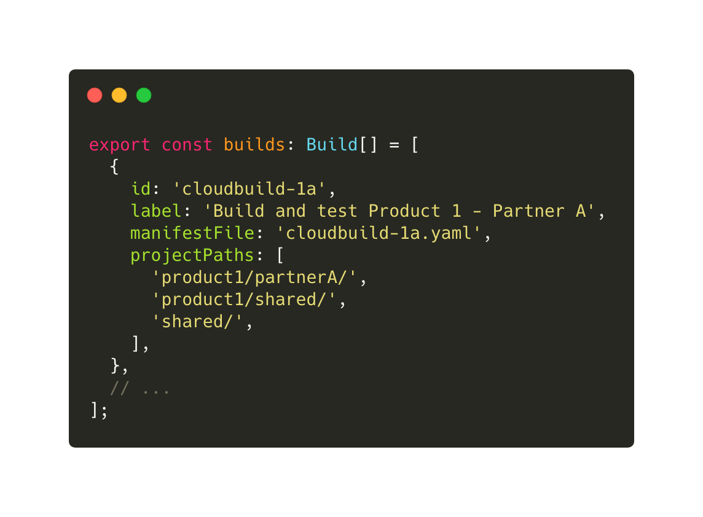
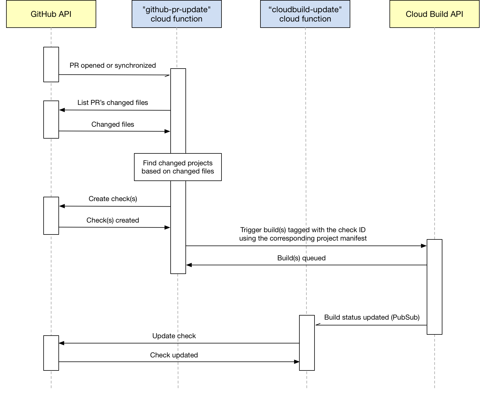

# Cloud Build on PRs

_Cloud Build on PRs_ is a GitHub App designed to trigger Google Cloud Build builds when GitHub pull requests are opened
or new commits are pushed to them.

The main differences with the official
[Google Cloud Build GitHub App](https://github.com/marketplace/google-cloud-build) are:

- Builds are only triggered for commits associated to an open PR, rather than all commits pushed to all branches
- It can trigger different types of builds (manifest files) depending on which files changed in the PR
- It can trigger multiple parallel builds, each appearing as an individual check on GitHub

## Configuration

The configuration of each build type can be set in file `cloud-functions/github-pr-update/src/config/builds.ts`.

Each build type has a label, which will appear in GitHub's checks list, a corresponding manifest file, and a list of
paths to watch for changes in order to trigger the build. A specific path can be watched by different build types,
perfect for files that are shared across different projects.

## How it works

This project uses the GitHub and Google Cloud Build APIs and is deployed as two Google Cloud Functions:
`github-pr-update` and `cloudbuild-update`.

In order to use GitHub's checks API, the cloud functions authenticate as the installation of the
["Cloud Build on PRs" GitHub App](https://github.com/apps/cloud-build-on-prs).

The desired functionality is:

1. Using the GitHub PR Webhook, detect when a PR is either opened or new commits are pushed to it
2. Use the GitHub API to list which files from this PR are changed
3. Based on these files, identify which of our projects have changed
4. Use the Google Cloud API to launch cloud builds using the manifests from the projects with changes
5. Use the GitHub API to create a check run to update the build status (in progress, failed, success) of the latest PR commit
6. Update the status of the check run whenever the cloud build's status is updated, by listening to Cloud Build PubSub messages

---

## Deploying to Google Cloud Functions

Google Cloud Functions are **not** automatically re-deployed on new git commits. You must manually redeploy them if any
changes are made. A change to the manifests however doesn't require a redeploy.

For both `github-pr-update` and `cloudbuild-update` projects:

1. Build the project: `yarn build`.
2. Push the `dist` folder to git.
3. Trigger a Cloud Function deployment from the GCP console by clicking "Edit" then "Save".

The following environment variables must be set for the cloud functions to run:

- `GITHUB_OWNER`: The GitHub repo's owner (user or organization name)
- `GITHUB_APP_ID`: The GitHub App's ID
- `GITHUB_APP_PRIVATE_KEY`: The GitHub App's private key
